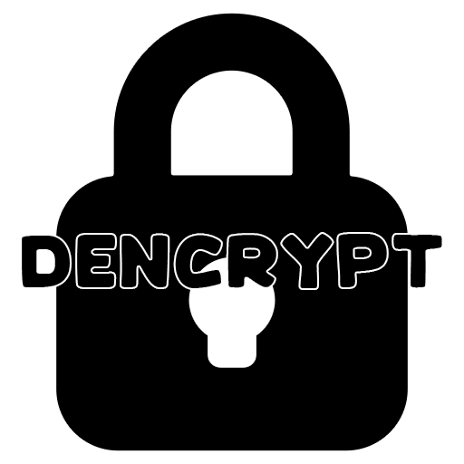
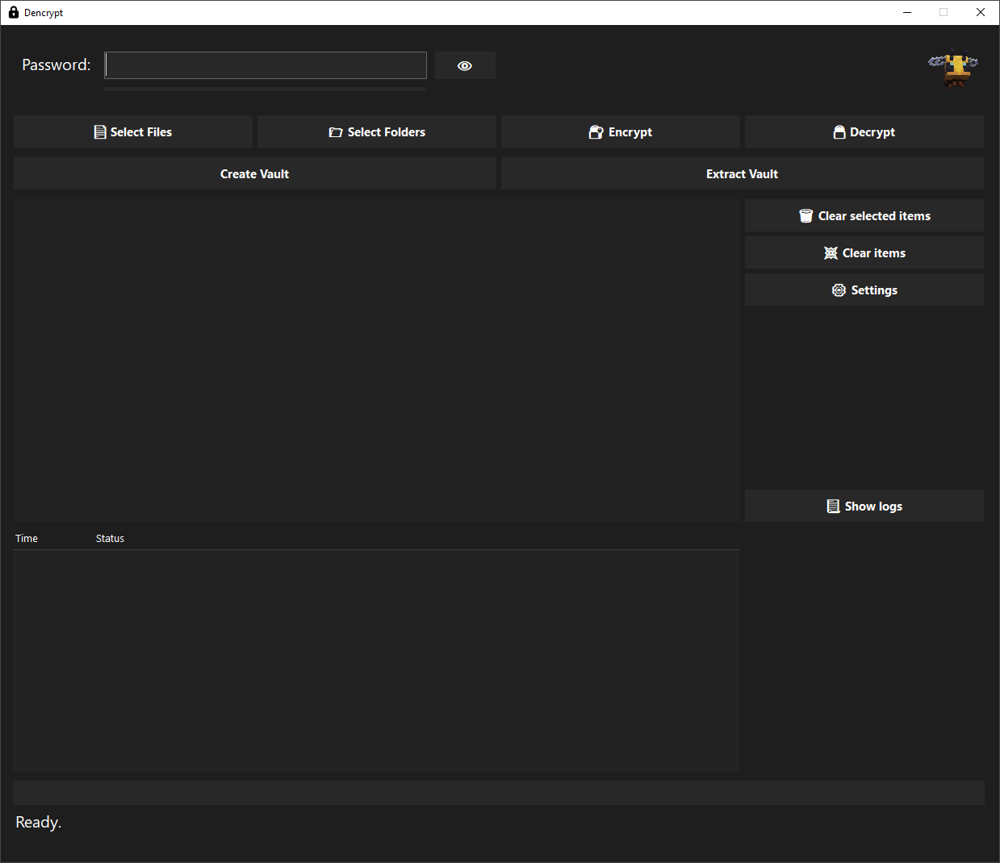

<p align="center">
  
</p>


<p align="center"><strong>Fast, modern and minimalistic file encryption and vaulting application written in C#</strong></p>

---

## 📦 Installation

#### NOTE : Settings are stored in "C:\Users\USERNAME\AppData\Roaming\Dencrypt"

### 🔧 Build from source:

```bash
git clone https://github.com/Ezi0-dev/dencrypt.git
cd dencrypt
dotnet build

dotnet run --project DencryptGUI
```

---

## ✨ Features

- 🔒 **AES-256 Encryption** with 100,000 iteration PBKDF2 key derivation
- 🧪 **Integrity Verification** via HMAC and SHA256 hash checking
- 📦 **Vault System**: Bundle folders and files into a single encrypted `.vault` file
- 📁 **Folder Support**: Include subdirectories and preserve full folder structure
- ⚙️ **Settings Menu**: Option to remove orignal files after encryption is completed
- 🧠 **Password Strength Meter**
- 🌙 **Dark Themed GUI**
- 🛡️ **Failsafe Handling**: Protects against vault corruption on failed decryption

---

## 🛠 Requirements

- Windows 10 or higher
- .NET 6.0 SDK or later (for development)
- WinForms runtime for user interface

---

## 📦 How Vaults Work

1. **Create a Vault**:
   - Select files or a folder
   - Encrypt them into a `.vault` file
   - Optional: Original files are deleted after vault creation

2. **Extract a Vault**:
   - Select the `.vault` file
   - Choose destination folder
   - Decrypts and unpacks all original contents

---

## 🖼️ UI Preview



---

## Disclaimer

This tool is intended for **educational and ethical use only**.

Do **not** use it to scan targets that you do not own or have explicit permission to test. Unauthorized scanning is illegal and unethical. The developer is **not responsible for any misuse** of this tool.

Use responsibly. 🛡️

**By Ezi0**
